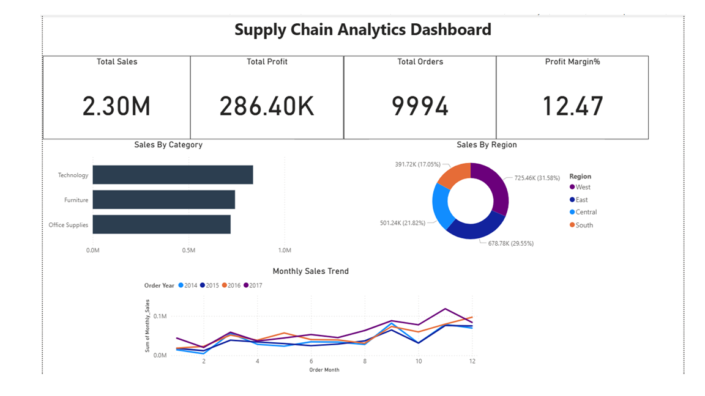
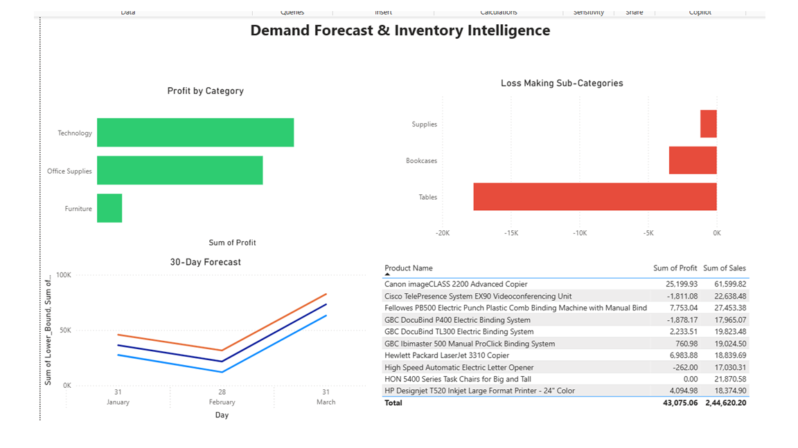

# 🚚 Supply Chain Analytics & Demand Forecasting System


## 📌 Project Overview
An end-to-end Supply Chain Analytics system built using Python, 
SQL, Facebook Prophet and Power BI. This project analyzes 4 years 
of retail sales data, identifies key business insights, forecasts 
future demand, and provides actionable inventory recommendations.

---

## 🎯 Problem Statement
Supply chain inefficiencies cost companies millions annually through 
overstocking, stockouts, and poor demand planning. This project 
analyzes Superstore sales data of 9,994 orders across 4 years to:
- Identify top performing and loss making products
- Analyze regional and seasonal demand patterns
- Forecast next 3 months demand using ML
- Provide inventory optimization recommendations

---

## 🛠️ Tools & Technologies
| Category | Tools |
|---|---|
| Language | Python 3.14 |
| Data Analysis | Pandas, NumPy |
| Visualization | Matplotlib, Seaborn |
| Forecasting | Facebook Prophet |
| Database | SQLite |
| BI Dashboard | Microsoft Power BI |
| IDE | VS Code + Jupyter Notebook |

---

## 📁 Project Structure
```
Supply-Chain-Analytics/
├── data/
│   └── processed/
│       └── superstore_cleaned.csv
├── notebooks/
│   ├── 01_EDA.ipynb
│   └── 02_Forecasting.ipynb
├── outputs/
│   ├── Charts (9 PNG files)
│   ├── forecast_results.csv
│   ├── forecast_future_only.csv
│   └── sql_*.csv files
└── README.md
```

---

## 📊 Dataset
- **Source:** Superstore Sales Dataset (Kaggle)
- **Size:** 9,994 orders × 21 variables
- **Period:** 2014 — 2017 (4 years)
- **Features:** Order Date, Category, Region, Sales, 
  Profit, Discount, Ship Mode, and 14 more

---

## 🔍 Key Findings from EDA

| # | Finding |
|---|---|
| 1 | Technology = highest sales category |
| 2 | West region = highest sales (31.58%) |
| 3 | Peak demand in **November** — holiday season |
| 4 | Discount vs Profit correlation: **-0.219** |
| 5 | Canon imageCLASS = #1 product ($61,599) |
| 6 | Tables, Bookcases, Supplies = **loss making!** |
| 7 | Technology = highest profit margin |
| 8 | Standard Class = 5 days avg delivery |
| 9 | West region = highest profit margin |

---

## 🤖 Demand Forecasting Results

| Metric | Value |
|---|---|
| Model | Facebook Prophet |
| Training Period | Jan 2014 — Dec 2017 |
| Forecast Period | Jan — Mar 2018 |
| **Forecast Accuracy** | **82.56%** |
| MAPE | 17.44% |

### 📅 3-Month Demand Forecast
| Month | Forecasted Sales |
|---|---|
| January 2018 | **$36,344** |
| February 2018 | **$21,682** ← Stock down |
| March 2018 | **$73,278** ← Stock up! |

---

## 💰 Business Impact

| Insight | Recommendation |
|---|---|
| Tables losing $17K+ | Discontinue or reprice |
| November peak demand | Stock up in September |
| High discounts cause losses | Cap discounts at 20% |
| West region dominates | Priority warehouse in West |
| March forecast $73K | Increase stock by February |

---

## 📈 Power BI Dashboard
2-page interactive dashboard:
- **Page 1:** Sales & Operations — KPIs, category, 
  regional analysis, monthly trends
- **Page 2:** Demand Forecast & Inventory — 3-month 
  forecast, loss products, top performers

### Dashboard Preview
#### Page 1 — Sales & Operations Overview


#### Page 2 — Demand Forecast & Inventory


---

## ▶️ How to Run

```bash
# 1. Clone the repository
git clone https://github.com/vaishnavianumalasetty/Supply-Chain-Analytics

# 2. Install dependencies
pip install pandas numpy matplotlib seaborn prophet jupyter ipykernel

# 3. Run notebooks in order
# Open notebooks/01_EDA.ipynb first
# Then open notebooks/02_Forecasting.ipynb

# 4. Open dashboard
# Open Supply_Chain_Dashboard.pbix in Power BI Desktop
```

---

## 👩‍💻 Author
**Vaishnavi Anumalasetty**
- 🔗 [LinkedIn](https://linkedin.com/in/vaishnavi-anumalasetty-171b51320)
- 🐙 [GitHub](https://github.com/vaishnavianumalasetty)
